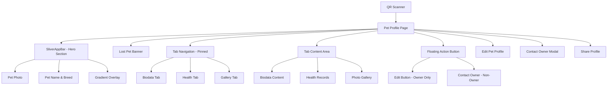
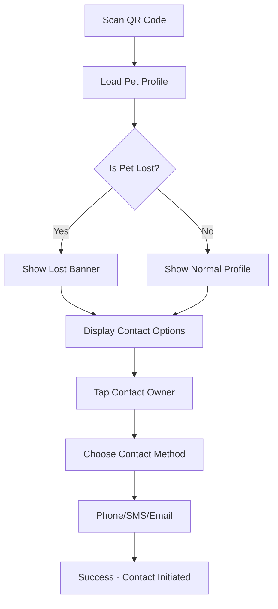
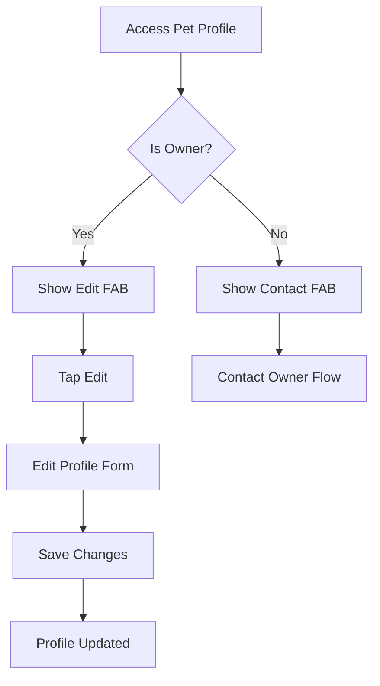

# Allnimall QR Pet App UI/UX Specification

## Introduction

This document defines the user experience goals, information architecture, user flows, and visual design specifications for Allnimall QR Pet App's user interface. It serves as the foundation for visual design and frontend development, ensuring a cohesive and user-centered experience.

### Overall UX Goals & Principles

#### Target User Personas

- **Pet Owner:** Responsible pet owners who want to manage their pet's profile, update information, and track scan activity
- **Pet Finder:** People who find lost pets and scan QR codes to contact owners quickly and safely
- **Veterinarian/Healthcare Provider:** Professionals who need access to pet health records for medical care

#### Usability Goals

- **Immediate Recognition:** Users can instantly understand pet identity and status (lost/found) within 3 seconds
- **Contact Efficiency:** Pet finders can contact owners within 2 taps maximum
- **Profile Management:** Owners can edit pet information with minimal friction
- **Emergency Response:** Lost pet alerts are prominently displayed and actionable

#### Design Principles

1. **Safety First** - Emergency contact information is always accessible
2. **Progressive Disclosure** - Show essential info first, details on demand
3. **Context-Aware Actions** - Different CTAs based on user role (owner vs finder)
4. **Visual Hierarchy** - Hero image creates emotional connection, tabs organize information
5. **Mobile-Optimized** - Designed for one-handed use and quick scanning scenarios

### Change Log

| Date       | Version | Description                            | Author            |
| ---------- | ------- | -------------------------------------- | ----------------- |
| 2024-12-19 | 1.0     | Initial Pet Profile Page specification | Sally (UX Expert) |

## Information Architecture (IA)

### Site Map / Screen Inventory

### Navigation Structure

**Primary Navigation:**

- Tab-based navigation within Pet Profile (Biodata, Health, Gallery)
- Pinned tab bar that remains visible during scroll
- Auto-scroll to top when tab is tapped for immediate visual feedback

**Secondary Navigation:**

- Back button in SliverAppBar for returning to previous screen
- Floating Action Button for primary actions (Edit/Contact)
- Hero transitions for smooth page transitions

**Breadcrumb Strategy:**

- Contextual breadcrumbs in SliverAppBar showing: "QR Scan → Pet Profile"
- Visual hierarchy through pet name prominence in hero section

## User Flows

### Flow 1: Pet Finder Discovers Lost Pet

**User Goal:** Find lost pet's owner and establish contact quickly

**Entry Points:** QR code scan, shared pet profile link

**Success Criteria:** Successful contact with pet owner within 30 seconds

#### Flow Diagram

#### Edge Cases & Error Handling:

- QR code leads to non-existent pet profile
- Pet owner contact information is outdated
- Network connectivity issues during profile load
- Pet profile is private/restricted

#### Notes:

**Critical UX Enhancement Needed:** Currently missing "Contact Owner" CTA for non-owners. This is the primary user journey and must be implemented immediately.

### Flow 2: Pet Owner Manages Profile

**User Goal:** Update pet information and monitor profile activity

**Entry Points:** Pet owner dashboard, direct profile access

**Success Criteria:** Profile updates saved successfully, scan activity visible

#### Flow Diagram

#### Edge Cases & Error Handling:

- Multiple owners with different permissions
- Profile edit conflicts (concurrent editing)
- Image upload failures
- Validation errors on form submission

#### Notes:

Current implementation correctly shows Edit FAB only for owners. Good permission-based UX.

## Wireframes & Mockups

### Primary Design Files

**Design Tool:** Flutter implementation serves as living prototype
**Reference Files:** Current `pet_profile_page.dart` implementation

### Key Screen Layouts

#### Pet Profile Page - Hero Section

**Purpose:** Create emotional connection and establish pet identity

**Key Elements:**

- Full-screen hero image with pet photo
- Gradient overlay for text readability
- Pet name prominently displayed (32px Poppins Bold)
- Breed information below name (16px Nunito)
- Back navigation and favorite actions in header

**Interaction Notes:**

- Hero image expands/contracts on scroll
- Smooth transitions with Hero widget
- Loading states with shimmer effect
- Error fallback with pet icon and gradient

**Design File Reference:** `lib/features/pet/presentation/pages/pet_profile_page.dart` lines 72-163

#### Pet Profile Page - Tab Navigation

**Purpose:** Organize pet information into digestible sections

**Key Elements:**

- Pinned tab bar with three tabs (Biodata, Health, Gallery)
- Primary color indicators for active state
- Auto-scroll to top when tab is tapped
- Consistent typography (14px Poppins 600)

**Interaction Notes:**

- Tab bar remains visible during scroll
- Smooth tab transitions
- Content lazy loading for performance

**Design File Reference:** `lib/features/pet/presentation/pages/pet_profile_page.dart` lines 170-189

## Component Library / Design System

### Design System Approach

**Approach:** Flutter Material Design 3 with custom color palette and typography
**Foundation:** Google Fonts (Poppins, Nunito) with custom AppColors system

### Core Components

#### SliverAppBar

**Purpose:** Expandable header with pet photo and information

**Variants:**

- Expanded state (300px height)
- Collapsed state (standard app bar height)
- Pinned behavior during scroll

**States:**

- Loading (shimmer placeholder)
- Loaded (pet image displayed)
- Error (gradient fallback with pet icon)

**Usage Guidelines:**

- Always use with Hero widget for smooth transitions
- Include gradient overlay for text readability
- Provide loading and error states

#### Pinned Tab Bar

**Purpose:** Persistent navigation within pet profile

**Variants:**

- Three-tab layout (Biodata, Health, Gallery)
- Custom delegate for sliver integration

**States:**

- Active tab (primary color indicator)
- Inactive tab (grey color)
- Hover states for web platform

**Usage Guidelines:**

- Always pin to maintain navigation context
- Auto-scroll to top on tab selection
- Use consistent typography and spacing

#### Floating Action Button

**Purpose:** Primary action based on user role

**Variants:**

- Edit FAB (for pet owners)
- Contact Owner FAB (for non-owners)
- Extended FAB with icon and label

**States:**

- Visible (when user has permission)
- Hidden (when user lacks permission)
- Loading (during action processing)

**Usage Guidelines:**

- Show only for appropriate user roles
- Use primary brand color
- Include clear icon and label

#### Lost Pet Banner

**Purpose:** Emergency alert for lost pet status

**Variants:**

- Full-width banner below hero section
- High contrast colors for visibility
- Action button for immediate contact

**States:**

- Visible (when pet.isLost = true)
- Hidden (normal pet profile)

**Usage Guidelines:**

- Use high contrast colors (red/orange)
- Include clear call-to-action
- Position prominently below hero section

## Branding & Style Guide

### Visual Identity

**Brand Guidelines:** Pet-focused, safety-oriented, mobile-first design system

### Color Palette

| Color Type | Hex Code         | Usage                                 |
| ---------- | ---------------- | ------------------------------------- |
| Primary    | #2196F3          | Main brand color, buttons, indicators |
| Secondary  | #FF9800          | Accent color, highlights              |
| Success    | #4CAF50          | Positive feedback, confirmations      |
| Warning    | #FF5722          | Lost pet alerts, important notices    |
| Error      | #F44336          | Errors, destructive actions           |
| Neutral    | #757575, #E0E0E0 | Text, borders, backgrounds            |

### Typography

#### Font Families

- **Primary:** Poppins (headings, buttons, UI elements)
- **Secondary:** Nunito (body text, descriptions)
- **Monospace:** Roboto Mono (code, technical data)

#### Type Scale

| Element | Size | Weight   | Line Height |
| ------- | ---- | -------- | ----------- |
| H1      | 32px | Bold     | 1.2         |
| H2      | 24px | SemiBold | 1.3         |
| H3      | 20px | SemiBold | 1.4         |
| Body    | 16px | Regular  | 1.5         |
| Small   | 14px | Regular  | 1.4         |

### Iconography

**Icon Library:** Material Design Icons
**Usage Guidelines:** Consistent 24px size, primary color for active states

### Spacing & Layout

**Grid System:** 8px base unit system
**Spacing Scale:** 4px, 8px, 16px, 24px, 32px, 48px

## Accessibility Requirements

### Compliance Target

**Standard:** WCAG 2.1 AA compliance

### Key Requirements

**Visual:**

- Color contrast ratios: 4.5:1 minimum for normal text, 3:1 for large text
- Focus indicators: Visible focus rings on all interactive elements
- Text sizing: Support for system font scaling up to 200%

**Interaction:**

- Keyboard navigation: Full keyboard accessibility for web platform
- Screen reader support: Semantic HTML and ARIA labels
- Touch targets: Minimum 44x44pt touch targets

**Content:**

- Alternative text: Descriptive alt text for all pet images
- Heading structure: Logical heading hierarchy (H1-H6)
- Form labels: Clear labels for all form inputs

### Testing Strategy

- Automated testing with axe-core for web
- Manual testing with VoiceOver (iOS) and TalkBack (Android)
- Color contrast validation with WebAIM tools

## Responsiveness Strategy

### Breakpoints

| Breakpoint | Min Width | Max Width | Target Devices   |
| ---------- | --------- | --------- | ---------------- |
| Mobile     | 320px     | 768px     | Smartphones      |
| Tablet     | 769px     | 1024px    | Tablets          |
| Desktop    | 1025px    | -         | Desktop browsers |

### Adaptation Patterns

**Layout Changes:**

- Single column layout on mobile
- Tab bar remains pinned across all breakpoints
- Hero image scales proportionally

**Navigation Changes:**

- Bottom tab navigation on mobile
- Side navigation on tablet/desktop
- Consistent floating action button placement

**Content Priority:**

- Hero image and pet name always visible
- Tab content adapts to screen width
- Contact information prominently displayed

**Interaction Changes:**

- Touch-optimized on mobile
- Hover states on desktop
- Consistent tap targets across platforms

## Animation & Micro-interactions

### Motion Principles

- **Purposeful:** Every animation serves a functional purpose
- **Respectful:** Respects user's motion preferences
- **Performance:** 60fps animations with hardware acceleration

### Key Animations

- **Hero Transitions:** Smooth image transitions between screens (Duration: 300ms, Easing: ease-in-out)
- **Tab Switching:** Subtle fade transition between tab content (Duration: 200ms, Easing: ease)
- **Scroll Animations:** Parallax effect on hero image (Duration: scroll-based, Easing: none)
- **FAB State Changes:** Scale animation on show/hide (Duration: 200ms, Easing: ease-out)
- **Loading States:** Shimmer animation for image placeholders (Duration: 1500ms, Easing: linear)

## Performance Considerations

### Performance Goals

- **Page Load:** Initial render within 1 second
- **Interaction Response:** Tap responses within 100ms
- **Animation FPS:** Maintain 60fps for all animations

### Design Strategies

- Lazy loading for tab content
- Cached network images with placeholders
- Optimized image formats (WebP with fallbacks)
- Minimal DOM manipulation for smooth scrolling

## Next Steps

### Immediate Actions

1. Implement "Contact Owner" CTA for non-owners (Critical UX gap)
2. Add ScrollController for auto-scroll tab behavior
3. Create skeleton loading states for better perceived performance
4. Add haptic feedback for mobile interactions
5. Implement proper error states and recovery flows

### Design Handoff Checklist

- [x] All user flows documented
- [x] Component inventory complete
- [x] Accessibility requirements defined
- [x] Responsive strategy clear
- [x] Brand guidelines incorporated
- [x] Performance goals established
- [ ] Visual mockups created in design tool
- [ ] Developer handoff documentation prepared
- [ ] User testing plan established

## Checklist Results

**Critical UX Issues Identified:**

1. **Missing Contact Owner CTA** - Primary user journey incomplete
2. **No Auto-scroll Behavior** - Tab interaction needs enhancement
3. **Limited Loading States** - Perceived performance can be improved
4. **Missing Haptic Feedback** - Mobile UX can be enhanced

**Recommendations:**

1. Prioritize Contact Owner implementation (business critical)
2. Add ScrollController integration for smooth tab navigation
3. Implement skeleton screens for better loading experience
4. Add micro-interactions for enhanced user delight
